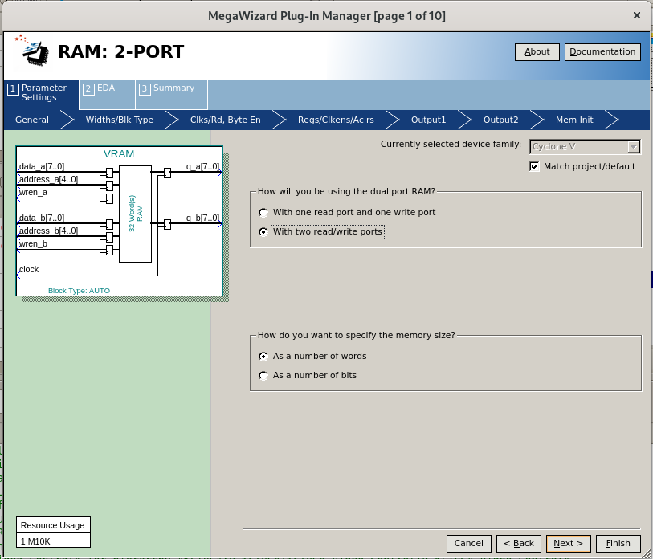

# How to install KFTVGA-DEMO on DE0-CV

## 1. Install Quartus Prime

## 2. Create project
"File" -> "New Project Wizerd" -> Follow the wizerd...

## 3. Create PLL
"IP Catalog" -> "PLL Intel FPGA IO"

- Reference Clock Frequency : 50MHz
- Enable locked output port : disable
- Desired Frequency : 25MHz

-> "Finish"

-> "Exit"

## 4. Create VRAM
"IP Catalog" -> "RAM: 2-PORT"

- Select "With two read/write ports"

-> "Next"

- 8-bit words of memory = 9600
- Enable "Use different data widths on different ports"
- 'q_a' output bus wide = 8
- 'q_b' output bus wide = 16

-> "Next"

- Select "Dual clock: use separate clocks for A and B ports"

-> "Next"

- Disable "Read output port(s)"

-> "Finish"

## 5. Add files
"Project" -> "Add/Remove Files to Project"

Add following files.
- top.sv
- KFTVGA.sv
- KFTVGA_Bus_Control_Logic.sv
- KFTVGA_VRAM_Use_Intel_IP.sv
- KFTVGA_Character_ROM.sv
- KFTVGA_Video_Control.sv
- KFTVGA.sdc

## 6. Compile
"Compile Design"

## 7. Pin assignments
"Assignments" -> "Pin Planner"

|Name    |I/O   |Pin     |
|:-------|------|--------|
|CLK     |Input |PIN_M9  |
|VGA_HS  |Output|PIN_H8  |
|VGA_VS  |Output|PIN_G8  |
|VGA_R[0]|Output|PIN_A9  |
|VGA_R[1]|Output|PIN_A10 |
|VGA_R[2]|Output|PIN_C9  |
|VGA_R[3]|Output|PIN_A5  |
|VGA_G[0]|Output|PIN_L7  |
|VGA_G[1]|Output|PIN_K7  |
|VGA_G[2]|Output|PIN_J7  |
|VGA_G[3]|Output|PIN_J8  |
|VGA_B[0]|Output|PIN_B6  |
|VGA_B[1]|Output|PIN_B7  |
|VGA_B[2]|Output|PIN_A8  |
|VGA_B[3]|Output|PIN_A7  |

"Processing" -> "Start I/O Assignment Analysis"

## 8. Compile

## 9. Configuration (sof file)
"Tool" -> "Programmer"

"Hardware Setup" -> "Start"

## 10. Run

