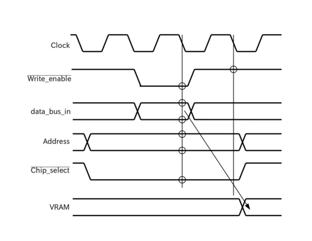

# KFTVGA - Simple text video controller written in SystemVerilog
## Specification
- 480x640 60Hz
- 8x8 fonts
- 16 colors
- 60x80 texts

## VRAM structure
|A13 - A1                       |A0|D7 - D0          |
|-------------------------------|--|-----------------|
|0000000000000B - 1001010111111B|0B|Display Character|
|0000000000000B - 1001010111111B|1B|Color            |

## Color word structure
|D7 - D4   |D3 - D0        |
|----------|---------------|
|Back Color|Character Color|

## Color palette
|Code|Color        |
|----|-------------|
|0H  |Black        |
|1H  |Blue         |
|2H  |Green        |
|3H  |Cyan         |
|4H  |Red          |
|5H  |Magenta      |
|6H  |Brown        |
|7H  |White        |
|8H  |Gray         |
|9H  |Light Blue   |
|AH  |Light Green  |
|BH  |Light Cyan   |
|CH  |Light Red    |
|DH  |Light Magenta|
|EH  |Yellow       |
|FH  |Bright White |

## Waveform

