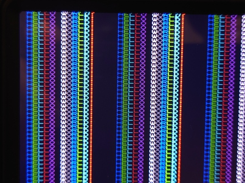
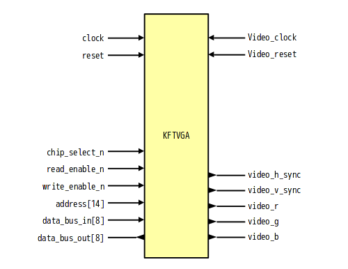

# KFTVGA - Simple text video controller written in SystemVerilog

## About
KFTVGA is simple text video controller.

## Features
- 480x640 60Hz (Video Cloock=25MHz)
- 8x8 fonts
- 16 colors
- 60x80 texts

## Block

